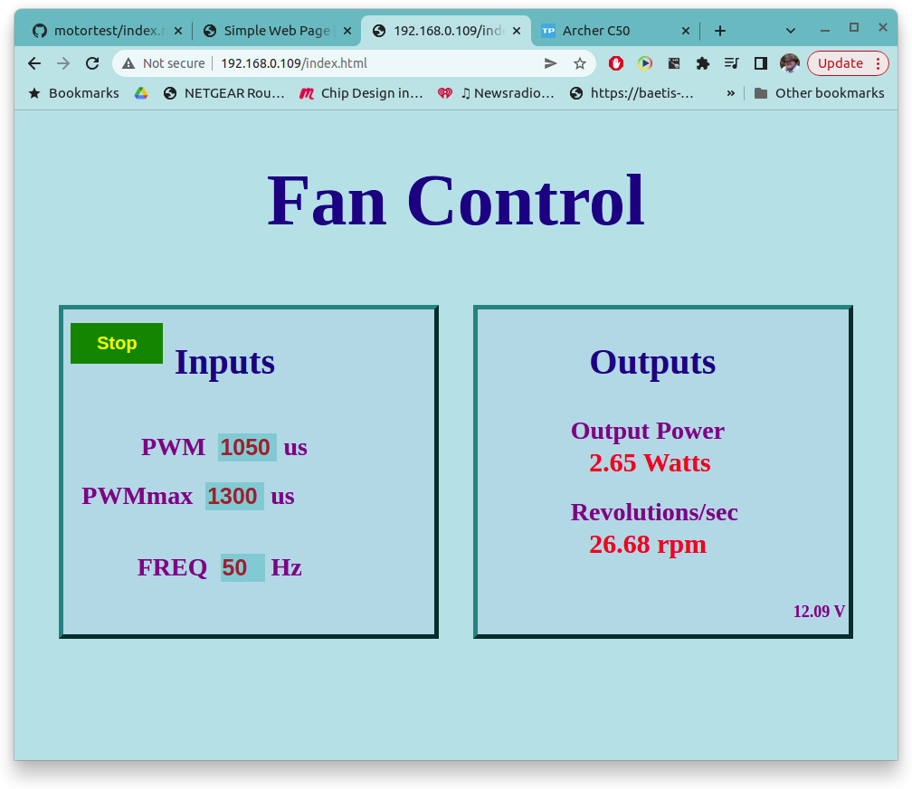

## Simple Web Page
</img>
#####  A project is decribed that uses a webpage to control a test of a motor with a propellor. The esp hosts a webpage allowing :
```
- power relay to the motor on/off
- frequency of esc pulses
- pwm pulse width to esc control
- rotation speed of motor
- thrust measured by strain guage
- current being used by esc
- voltage into esc
```
##### The webpage shot to the right shows the responce and control fields assisting this test. The webpage is loaded when session is started and remains resident. The index.html embeds javascript code that responds to actions initiated by the user clicking or entering action fields on the browser display and in responce generates a tcp packet with a resource field of `GET /trfData?vout=0x40+pwm=1222+freq=50+onoff=0`. The javascript as responds to the return packet from the esp in the form `data,3.0960,3.8640,4.6320,5.4000,0.000000,inf,`, this is the data being collected from ADCs and a pulse counter on the esp, the javascript parses this data and updates the diplay with rev/min, power, voltage and weight measurements.
##### Using curl commands in a shell (or perl) script allows programmatic control of motor testing, where the pwm can be adjusted upward slowly and the motor speed, motor power and generated thrust can be saved to a file and studied with gnuplot afterward.
##### This project sets up a simple tcp socket with enough functionality to serve up a stand-alone .html file and handle bi-directional data flow between the esp device and the browser.
##### The tcp_server_task in the esp takes the incoming IP packets combines, windows, verifies/requests retransmission, and notifies us that an http request is ready. When I filled 192.168.0.122/index.html into my browser address bar window the contents of the tcp server (running over in my esp running a wifi connection at IP adrress 192.168.0.122) receive buffer were:
```
GET /trfData?vout=0x40+pwm=1300+freq=50+onoff=0 HTTP/1.1
Host: 192.168.0.106
Connection: keep-alive
User-Agent: Mozilla/5.0 (X11; Linux x86_64) AppleWebKit/537.36 (KHTML, like Gecko) Chrome/99.0.4844.51 Safari/537.36
Content-Type: application/bin
Accept: */*
Referer: http://192.168.0.106/index.html
Accept-Encoding: gzip, deflate
Accept-Language: en-US,en;q=0.9,la;q=0.8

curl --http0.9 192.168.0.109/trfData?vout=0x40+pwm=1222+freq=50+onoff=0 --output - 
data,0.0118,2.7418,0.6036,0.6026,0.037810,26.45,
```
##### A curl command from a terminal any where on same lan as the esp
```
curl --http0.9 192.168.0.106/trfData?vout=0x40+pwm=1300+freq=50+onoff=0 --output -
```
##### will respond with
```
data,3.0960,3.8640,4.6320,5.4000,0.000000,inf,
```
##### A perl program
## Setting up


</img>

##### Data from test run
```
#unix epoch  1651148532.138633
#     time     throttle    power    rps   vbatt   onoff
    6.394765     1000      0.00     Inf    12.5   1
   12.543179     1000      0.00     Inf    12.5   0
   18.682864     1025      1.78    21.0    12.5   0
   24.829150     1030      1.97    22.4    12.5   0
   30.972240     1035      2.17    23.9    12.4   0
   37.114332     1040      2.34    25.7    12.5   0
   43.251697     1050      2.80    27.1    12.4   0
   49.402244     1060      3.25    29.3    12.4   0
   55.542395     1070      3.70    31.8    12.4   0
   61.681796     1085      4.45    35.2    12.4   0
   67.832860     1100      5.26    38.1    12.4   0
   73.971681     1125      6.73    42.3    12.4   0
   80.122310     1150      8.28    45.9    12.4   0
   86.263055     1175     10.18    49.3    12.3   0
   92.401923     1200     12.43    55.9    12.3   0
   98.554423     1225     15.29    63.8    12.3   0
  104.691273     1250     18.54    64.2    12.2   0
  110.842222     1275     21.75    65.6    12.2   0
  116.981214     1300     25.50    71.8    12.1   0
  123.131238     1325     27.68    75.9    12.1   0
  129.270606     1350     32.43    85.5    12.0   0
  135.410633     1375     36.79    82.0    12.0   0
  141.562083     1400     42.63    87.3    11.9   0
  147.699946     1425     48.00    85.0    11.8   0
  153.852021     1450     53.60    90.1    11.7   0
  159.990325     1475     60.06    95.2    11.7   0
  166.141927     1505     67.73    93.2    11.6   0
  172.281640     1525     73.35    97.8    11.5   0
  178.420201     1550     79.75   100.6    11.5   0
  184.570155     1575     86.20   100.1    11.4   0
  190.732868     1600     91.39   100.6    11.3   0
  196.859747     1625     96.76   106.5    11.3   0
  202.999719     1650    102.48   107.7    11.3   0
  209.139167     1675    101.49    99.9    11.1   0
  215.290148     1700    117.75   111.0    11.1   0
```
##### Another earlier repository https://baetis-ma.github.io/esp32-idf-website/ goes through setting up another very similar project with out the javascript. It describes a lot of the isoftware setup and function of a project similar enough to this project do not get repeated here. 
