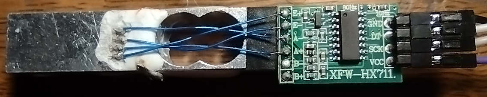

## Motor Testing Fixture Control
</img>
#####  A project is decribed that provides a test of a pwm controlled esc/motor with a propellor. This project sets up a simple tcp socket with enough functionality to serve up a stand-alone .html file and handle bi-directional data flow between the esp device and the client data collecting device. Features of the setup include:
```
- power relay to the motor ESC power on/off
- current being used by esc
- voltage into esc
- pwm frequency and pulse width to esc control
- measure of rotation speed of motor
- thrust measured by strain guage
- a user interface either by webpage of curl/netcat commands
```
#### ESP System Control
##### An esp gpio pin controls the action of a relay module to turn the power going to the ESC module on or off. Power connectors are supplied for either a 12v dc wall transformer power supply or a LiPo 3S cell. Five volts for the esp and its periferals is supplied by 12-5 volt power converter. An ads1115 4 channel adc on an i2c bus monitors the 12v input voltage through a reistance divider and the amount of current used by the system by measuring voltage drop across 0.1 ohm resitor in series with the ESC ground. The pwm control signal to the ESC is generated by the esp-idf mcpwm periferal.
</img>
##### The speed of the motor is measured with an obstacle avoidance IR Infrared Sensor Module EK1254 module hooked up to an esp gpio input which triggers interrupts when the reflected light levels changes. The delta time in usec since the last trigger is stored and low pass filtered. The attached photo shows the setup, the sensor module is placed so that ir light bounces off the casing of the motor and is returned to the modules IR detector. A piece of black electrical tape is attached to about a half od the motors case so that when the motor revolves the sensor outputs a zero when the electrical tape is facing it and a one when the IR light relects off the shiny motor casing. The photo diode is placed near the motor and mounted so that the assembly can pivot realive to the motor, placing a dark drinking straw over the photodiode helps the sensitivity. The variable resistor on the module may need to be adjusted as ambinet light levels change. Aiming the module at a part of the motor with the pack electrical tape adjust the variable resistor so that the sensor light just goes out, rotate the motor and verify that light is on during portion of the rotation that the electrical tape is not visible.
</img>
##### I ordered a load cell and two hx711 measurement modules from aliexpress for $3.17, six weeks later I got the package - the load cell had one wire left attached and other less obviuos damage (also only one of the hx711s enclosed). When the white coating was peeled back with a pair of tweasers under a microscope the four places where the wires were attached are plainly visable (see picture to right). When the reisitance was measured between these wires (the loads are resistive so six possibilities) between adjacent leads the resistance was about 1Kohm (except between pin two and three the resistance was 3Kohms), the resistance between pins separated by a pin was 2Kohms. Turns out that the idividual strain resistors in this module have a 1Kohm nominal resitance and are configured as a wheatstone bridge. Inspecting the load cell soon indicated that one of the magnet wires going around an edge of the load cell was frayed and open. The broken wires were pulled up out of the white expoxy and cleaned by heating for 15 seconds in a blob of molten solder and then attached with a short jumper of wirewrap wire. Now the resistances bewteen adjacent pins was 750ohms and opposite pins was 1Kohm, which is what you should expect - a two volt source was attached to opposite pins and the other set of opposite pins was measured the have 0.5mV present, this is also what you would expect on a load cell. 
</img>
##### The picture above shows the completed load cell after the hx711 module was double sided foam taped in and the necessary jumper wires installed.
##### Couldn't find any code I liked with quick google seach and deceided to write hx711 driver. A good data sheet is available on this part, came up with the following code. The dout pin will go low when conversion is complete and data is ready to be read. The clock is toggled 25 times and data read bit by bit. The 24 bits of data comes out msb first.
```C
#include "esp_timer.h"
#include "rom/ets_sys.h"
float hx711volt, hx711voltlpi = 0;

void hx711_read(float hx711_mv) {
   uint8_t data[4] = {0,0,0,0};
   while(gpio_get_level(GPIO_KX711_DOUT) == 1){
      printf("waiting\n");
      vTaskDelay(10);
   }
   for(int i = 0; i < 25; i++) {
      gpio_set_level(GPIO_KX711_SCK, 1);
      ets_delay_us(10);
      if(gpio_get_level(GPIO_KX711_DOUT) == 1) data[i/8] |= (1 << (7-(i%8)));
      gpio_set_level(GPIO_KX711_SCK, 0);
      ets_delay_us(10);
   }
   hx711volt = 20*(float)(16777216*data[0]+65536*data[1]+256*data[2]+data[3])/(1ULL<<31);
   hx711voltlp = 0.9 hx711voltlp + 0.1 * hx711volt;
   //printf("%8.5fmv\n", hx711voltlp);
   return(hx711voltlp);
}
```
##### The loadcell measurement does not seem to drift much over time, are very stable when just sitting there and sports few maverics. Mine calibrated out to 2.8uV/gram. The 1kg load cell that was tested appears that it might be accurate down to better than 0.1g, this was not tested very much becase on this project we are only looking for in the range of 10g accuracy.
#### ESP Communication
##### The system communications are established through a tcp server listening for a tcp connection with either a `GET /index.html` or `GET /trfData?<string>` at the head of the request payload. The index.html request causes the tcp server to return a html page stored in the esp eprom. The transfer data request (trfData) transfers comtrol data from the client to the esp and then the esp returns data gatered from the esp to the client.
##### The webpage shown up at the top shows the control and responce fields, div tags, assisting this test. The webpage is loaded when browser requests the url `192.168.0.125/index.html` and remains resident in broswer till exited. The index.html embeds javascript code that responds to actions initiated by the user clicking or entering action fields on the browser display and in responce generates a tcp packet with a resource field of `GET /trfData?pwm=1222+freq=50+onoff=0`. The javascript responds to the request packet from the esp in the form `data,123.3,12.31,5.40,50.2,0.019,`, this is the data being collected from ADCs and a pulse counter on the esp, the javascript parses this data and updates the diplay with rev/sec, power, voltage and weight measurements. The javascript also repeats the current request every few seconds in order to keep the data responce section of the webpage current.
##### The tcp_server_task in the esp listens and connects the to the incoming IP packets then notifies us that an http request is ready for parsing. When I filled 192.168.0.122/index.html into my browser address bar window the contents of the tcp server (running over in my esp running a wifi connection at IP adrress 192.168.0.122) receive buffer were:
```
GET /index.html HTTP/1.1
Host: 192.168.0.125
Connection: keep-alive
Cache-Control: max-age=0
Upgrade-Insecure-Requests: 1
User-Agent: Mozilla/5.0 (X11; Linux x86_64) AppleWebKit/537.36 (KHTML, like Gecko) Chrome/96.0.4664.45 Safari/537.36
Accept: text/html,application/xhtml+xml,application/xml;q=0.9,image/avif,image/webp,image/apng,*/*;q=0.8,application/signed-exchange;v=b3;q=0.9
Accept-Encoding: gzip, deflate
Accept-Language: en-US,en;q=0.9
```
##### The esp receives the following type of packet from a client with a command string, the esp tcp server replies with a string containing the data collected by the esp
```
GET /trfData?pwm=1000+freq=50+onoff=1 HTTP/1.1
Host: 192.168.0.125
Connection: keep-alive
User-Agent: Mozilla/5.0 (X11; Linux x86_64) AppleWebKit/537.36 (KHTML, like Gecko) Chrome/96.0.4664.45 Safari/537.36
Content-Type: application/bin
Accept: */*
Referer: http://192.168.0.125/index.html
Accept-Encoding: gzip, deflate
Accept-Language: en-US,en;q=0.9

```
##### A curl or netcat command from a terminal any where on same lan as the esp can issue same request
```
curl --http0.9 192.168.0.125/trfData?pwm=1300+freq=50+onoff=0 --output -
or
printf 'GET /trfData?pwm=1100+freq=50+onoff=0 HTTP/1.1\r\n\r\n' | nc 192.168.0.125 80
```
##### the tcpserver running on the esp will respond with something like
```
data,66.94,12.09,0.4930,0.0303,33.05,
```
###### where 30.9 is thrust in grams, 12.86 is battery voltage, 4.63 is esc current, 50.0 is rec/sec of motor and 0.0200 period of motor revolution.
##### Using curl (or netcat) commands in a shell (or perl) script allows programmatic control of motor testing, where the pwm can be adjusted upward slowly and the motor speed, motor power and generated thrust can be saved to a file and studied with gnuplot afterward.
##### A perl program sent out curl commands and received the javascript resonce with raw ADC and pulse with mesurements. The perl program time stamped the reciept (relative to unix epoch even), calculated current by dividing measured voltage divided by 0.1 ohms, calculated battery voltage from output voltage after resistor divider and the rps from the pulse width. The outputs were stored in a table and examined with gnuplot.
```perl
#!/usr/bin/perl
#use warnings;
#use strict;
use Time::HiRes qw(usleep);
my ($startseconds, $startmicroseconds) = Time::HiRes::gettimeofday;
printf("#unix epoch  %0.6f\n", $startseconds+$startmicroseconds/1000000);

my @data;
my $period, $rps;
my $weight, $current, $battery;
my $onoff = 1;
my $pwm = 1000;
my $trfData;
my $motors;
my $nowwtime, $seconds, $microseconds;

printf("# time      throttle    power     rps   vbatt   weight     onoff\n");
for ($i = 0; $i <= 36; $i++) {
   if($i ==  0) {$pwm = 1000; $onoff = 1};
   if($i ==  1) {$pwm = 1000; $onoff = 0};

   if($i ==  2) {$pwm = 1025; $onoff = 0};
   if($i ==  3) {$pwm = 1030; $onoff = 0};
   if($i ==  4) {$pwm = 1035; $onoff = 0};
   if($i ==  5) {$pwm = 1040; $onoff = 0};
   if($i ==  6) {$pwm = 1050; $onoff = 0};
   if($i ==  7) {$pwm = 1060; $onoff = 0};
   if($i ==  8) {$pwm = 1070; $onoff = 0};
   if($i ==  9) {$pwm = 1085; $onoff = 0};
   if($i == 10) {$pwm = 1100; $onoff = 0};
   if($i == 11) {$pwm = 1125; $onoff = 0};
   if($i == 12) {$pwm = 1150; $onoff = 0};
   if($i == 13) {$pwm = 1175; $onoff = 0};
   if($i == 14) {$pwm = 1200; $onoff = 0};
   if($i == 15) {$pwm = 1225; $onoff = 0};
   if($i == 16) {$pwm = 1250; $onoff = 0};
   if($i == 17) {$pwm = 1275; $onoff = 0};
   if($i == 18) {$pwm = 1300; $onoff = 0};
   if($i == 19) {$pwm = 1325; $onoff = 0};
   if($i == 20) {$pwm = 1350; $onoff = 0};
   if($i == 21) {$pwm = 1375; $onoff = 0};
   if($i == 22) {$pwm = 1400; $onoff = 0};
   if($i == 23) {$pwm = 1425; $onoff = 0};
   if($i == 24) {$pwm = 1450; $onoff = 0};
   if($i == 25) {$pwm = 1475; $onoff = 0};
   if($i == 26) {$pwm = 1505; $onoff = 0};
   if($i == 27) {$pwm = 1525; $onoff = 0};
   if($i == 28) {$pwm = 1550; $onoff = 0};
   if($i == 29) {$pwm = 1575; $onoff = 0};
   if($i == 30) {$pwm = 1600; $onoff = 0};
   if($i == 31) {$pwm = 1625; $onoff = 0};
   if($i == 32) {$pwm = 1650; $onoff = 0};
   if($i == 33) {$pwm = 1675; $onoff = 0};
   if($i == 34) {$pwm = 1700; $onoff = 0};

   if($i == 35) {$pwm = 1000; $onoff = 0};
   if($i == 36) {$pwm = 1000; $onoff = 1};

   $trfData = "trfData?vout=0x00+pwm=$pwm+freq=50+onoff=$onoff";
   $motors = `curl --silent --http0.9 192.168.0.125/$trfData --output -`;
   sleep(2);
   $motors = `curl --silent --http0.9 192.168.0.125/$trfData --output -`;
   @data = split(/,/, $motors);
   $weight   = $data[1];
   $current  = $data[2];
   $battery  = $data[3];
   $period   = $data[4];
   $rps      = $data[5];

   #usleep(250000);
   my ($seconds, $microseconds) = Time::HiRes::gettimeofday;
   my $nowtime = $seconds-$startseconds+($microseconds-$startmicroseconds)/1000000;
   if($pwm > 1000 or $i < 5) {printf("  %9.6f     %4d    %5.2f   %5.1f    %4.1f  %4.1f  %d\n",
                         $nowtime, $pwm, $battery * $current, $rps, $dcin, $weight, $onoff);}
}
```
</img>
##### Data from test run
```
#unix epoch  1651148532.138633
#     time     throttle    power    rps   vbatt   onoff
    6.394765     1000      0.00     Inf    12.5   1
   12.543179     1000      0.00     Inf    12.5   0
   18.682864     1025      1.78    21.0    12.5   0
   24.829150     1030      1.97    22.4    12.5   0
   30.972240     1035      2.17    23.9    12.4   0
   37.114332     1040      2.34    25.7    12.5   0
   43.251697     1050      2.80    27.1    12.4   0
   49.402244     1060      3.25    29.3    12.4   0
   55.542395     1070      3.70    31.8    12.4   0
   61.681796     1085      4.45    35.2    12.4   0
   67.832860     1100      5.26    38.1    12.4   0
   73.971681     1125      6.73    42.3    12.4   0
   80.122310     1150      8.28    45.9    12.4   0
   86.263055     1175     10.18    49.3    12.3   0
   92.401923     1200     12.43    55.9    12.3   0
   98.554423     1225     15.29    63.8    12.3   0
  104.691273     1250     18.54    64.2    12.2   0
  110.842222     1275     21.75    65.6    12.2   0
  116.981214     1300     25.50    71.8    12.1   0
  123.131238     1325     27.68    75.9    12.1   0
  129.270606     1350     32.43    85.5    12.0   0
  135.410633     1375     36.79    82.0    12.0   0
  141.562083     1400     42.63    87.3    11.9   0
  147.699946     1425     48.00    85.0    11.8   0
  153.852021     1450     53.60    90.1    11.7   0
  159.990325     1475     60.06    95.2    11.7   0
  166.141927     1505     67.73    93.2    11.6   0
  172.281640     1525     73.35    97.8    11.5   0
  178.420201     1550     79.75   100.6    11.5   0
  184.570155     1575     86.20   100.1    11.4   0
  190.732868     1600     91.39   100.6    11.3   0
  196.859747     1625     96.76   106.5    11.3   0
  202.999719     1650    102.48   107.7    11.3   0
  209.139167     1675    101.49    99.9    11.1   0
  215.290148     1700    117.75   111.0    11.1   0
```

</img>
#### Result Discussion
##### Initial debug testing was done with a 2 Amp 12 volt wall transformer supply which was really limited to about 20 Watts, even drawing one amp the voltage was reduced by almost a volt. The first test was disappointing in that the thrust measurements were much lower than expected, turns out there was a 1045 propellor attached to a clockwise rotating motor (50-50 chance!). The propellor was turned upside down and the test repeated with results more in line with expected. Next a 1045R propellor was found and attached and the results were vrey similar to the upside down 1045.

##### 
## Setting up 
##### Another earlier repository https://baetis-ma.github.io/esp32-idf-website/one amp the voltage bu a half volt goes through setting up another very similar project with out the javascript. It describes a lot of the isoftware setup and function of a project similar enough to this project do not get repeated here. 
##### I am hoping to get some quality characterization data from the 30A esc-A2212/13T 10000KV motors-1045 propellers system in the hopes of writting a simulation program for my drone, but we'll see how that goes.
